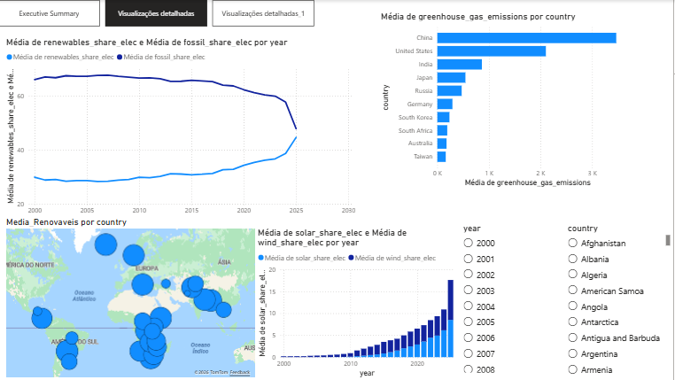
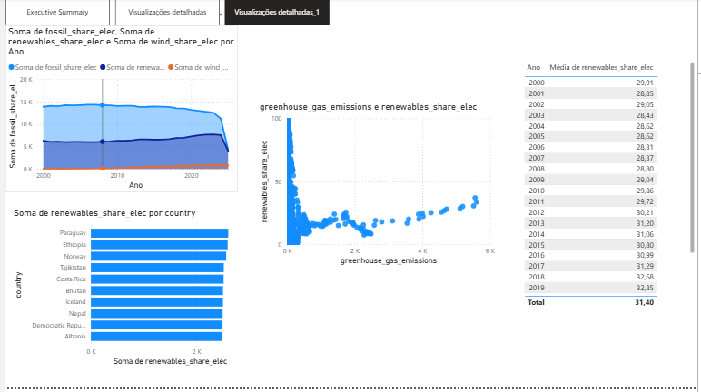
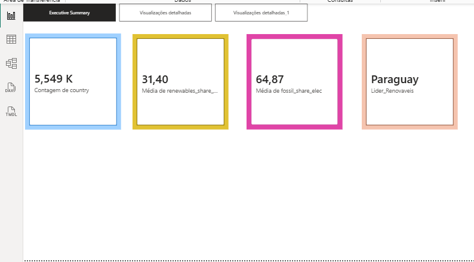

## Objetivo

Este projeto tem como objetivo explorar e comunicar visualmente padrões e insights sobre a **transição energética global** — analisando a evolução do consumo de energias renováveis e fósseis, as emissões de CO₂ por país, e o crescimento de fontes como solar e eólica ao longo do tempo.

As visualizações foram desenvolvidas em **Power BI** com base no dataset *Our World in Data – Energy*.

## Dataset

- **Ficheiro:** `owid-energy-data.csv`
- **Dimensão original:** 23.377 linhas × 130 colunas
- **Cobertura temporal:** 1900 – 2025
- **Cobertura geográfica:** 314 países e regiões

## Tecnologias
**Power BI Desktop** — criação do dashboard e visualizações
- **Power Query** — limpeza e transformação dos dados
- **DAX** — criação de medidas calculadas

## Transformações Realizadas

As seguintes transformações foram aplicadas no **Power Query** do Power BI:

### 1. Filtragem de países reais
- Removidas linhas com `iso_code` nulo (regiões agregadas como "Africa", "ASEAN", etc.)
- Filtradas apenas entradas com `iso_code` de comprimento igual a 3 (códigos ISO válidos)
- Resultado: **220 países** reais

### 2. Filtragem temporal
- Filtrados apenas anos **≥ 2000**, onde os dados são mais completos e relevantes para análise contemporânea

### 3. Remoção de colunas desnecessárias
Mantidas apenas as colunas relevantes para as visualizações:

| Coluna | Descrição |
|---|---|
| `country` | Nome do país |
| `year` | Ano |
| `iso_code` | Código ISO do país |
| `population` | População |
| `renewables_share_elec` | % de eletricidade gerada por renováveis |
| `fossil_share_elec` | % de eletricidade gerada por fósseis |
| `solar_share_elec` | % de eletricidade gerada por solar |
| `wind_share_elec` | % de eletricidade gerada por eólica |
| `coal_share_elec` | % de eletricidade gerada por carvão |
| `greenhouse_gas_emissions` | Emissões de gases de efeito estufa |
| `primary_energy_consumption` | Consumo total de energia primária |
| `low_carbon_share_elec` | % de eletricidade de baixo carbono |

### 4. Conversão de tipos
- Colunas numéricas convertidas para **Número Decimal** usando região "Inglês (Estados Unidos)" para compatibilidade com o separador decimal `.`

### 5. Medidas DAX criadas
```dax
Media_Renovaveis = AVERAGE('owid-energy-data'[renewables_share_elec])

Media_Fosseis = AVERAGE('owid-energy-data'[fossil_share_elec])

Lider_Renovaveis =
MAXX(
    TOPN(1,
        FILTER('owid-energy-data', 'owid-energy-data'[year] = 2023),
        'owid-energy-data'[renewables_share_elec], DESC
    ),
    'owid-energy-data'[country]
)
```

---

## Objetivos das Visualizações
O foco central do dashboard é analisar a **Transição Energética Global**. Os objetivos específicos incluem:
*   **Evolução do Mix Elétrico:** Comparar a dependência de combustíveis fósseis (`fossil_share_elec`) face ao crescimento das energias renováveis (`renewables_share_elec`) ao longo das décadas.
*   **Análise de Tecnologias Limpas:** Destacar a penetração específica da energia solar e eólica no sistema produtivo.
*   **Interatividade Geográfica:** Permitir ao utilizador filtrar dados por país para observar disparidades regionais na adoção de energias sustentáveis.
*   **Rigor Temporal:** Analisar tendências consolidadas entre 2000 e 2023, excluindo dados incompletos de anos posteriores.

## Transformações e Modelação (ETL)
Para garantir a integridade dos dados e a performance do Power BI, foram aplicadas as seguintes transformações:
1.  **Criação de Tabela de Dimensão:** Foi criada uma tabela `Tabela_Anos` contendo valores únicos de anos para estabelecer uma relação de **Um para Muitos (1:N)** com o dataset de factos.
2.  **Ajuste de Cardinalidade:** A relação foi configurada com **Direção de Filtro Única** (Tabela_Anos -> owid-energy-data), seguindo as boas práticas de modelação em estrela (*Star Schema*).
3.  **Correção de Agregações:** As métricas de *share* (percentagens) foram configuradas para **Média (Average)** em vez de Soma, garantindo que o mix energético mundial seja representado de forma estatisticamente correta.
4.  **Categorização de Dados:** A coluna `country` foi definida com a categoria geográfica "País", permitindo a criação de visuais cartográficos precisos.





